# 📈 Cybersecurity: Splunk SIEM SSH Authentication Log Analysis & Threat Detection

## 📖 Table of Contents
- [Introduction to SSH Telemetry Auditing](#-introduction-to-ssh-telemetry-auditing)
- [Project Overview](#-project-overview)
- [Objective](#-objective)
- [System Specifications & Ingestion Schema](#️-system-specifications--ingestion-schema)
- [Deployment Methodology & Analysis Workflow](#-deployment-methodology--analysis-workflow)
  - [Phase 1: Dashboard Initialization & Input Controls](#phase-1-dashboard-initialization--input-controls)
  - [Phase 2: SSH Telemetry Ingestion & Data Onboarding](#phase-2-ssh-telemetry-ingestion--data-onboarding)
  - [Phase 3: Core Authentication Metrics & Metric Panels](#phase-3-core-authentication-metrics--metric-panels)
  - [Phase 4: Account Enumeration & Targeted User Analysis](#phase-4-account-enumeration--targeted-user-analysis)
  - [Phase 5: Source Network Triage & Geographic IP Mapping](#phase-5-source-network-triage--geographic-ip-mapping)
- [Executive Summary & Exported Artifacts](#-executive-summary--exported-artifacts)
- [Security Relevance & SOC Impact](#-security-relevance--soc-impact)
- [Ethical Guidelines & Disclaimer](#️-ethical-guidelines--disclaimer)

---

## 🛑 Introduction to SSH Telemetry Auditing
The **Secure Shell (SSH)** protocol is the standard mechanism for secure remote administrative access to Linux servers, cloud infrastructure, and network appliances. Because port 22 is frequently exposed to external or untrusted networks, SSH services represent a high-priority target for automated dictionary attacks, password spraying, and distributed credential stuffing.

In a Security Operations Center (SOC), centralizing and analyzing SSH authentication logs via a Security Information and Event Management (SIEM) solution like **Splunk Enterprise** provides critical visibility into ingress vectors. By ingesting, parsing, and visualizing authentication events in real time, security analysts can differentiate routine operational traffic from sustained brute-force campaigns, identify heavily targeted usernames, and geolocate threat actor infrastructure.

## 📌 Project Overview
This project demonstrates end-to-end log ingestion, field extraction, Search Processing Language (SPL) construction, and executive dashboard engineering inside a locally hosted Splunk Enterprise instance. It details the analysis of JSON-formatted SSH authentication telemetry, isolating successful logins from brute-force attempts, evaluating high-risk account targeting, identifying high-frequency attacking IP addresses, and visualizing origin networks using geometric choropleth mapping.

## 🎯 Objective
To transform raw, complex SSH event streams into actionable security intelligence. By structuring SPL searches and building a dark-theme executive dashboard, this lab provides Blue Team defenders and SOC analysts with rapid single-pane-of-glass triage capabilities to detect, quantify, and mitigate brute-force authentication attacks.

## 🛠️ System Specifications & Ingestion Schema
*   **Platform:** Splunk Enterprise v10.4.2 (64-bit)
*   **Environment:** Windows Server / Host System
*   **Web Interface:** `localhost:8000`
*   **Source File:** `ssh_logs_new.json`
*   **Assigned Host Attribute:** `Datta-Guru`
*   **Target Index:** `Default`
*   **Key Parsed Schema Fields:**
    *   `event_type`: Categorical event descriptor (`Successful SSH Login`, `Failed SSH Login`, `Multiple Failed Authentication Attempts`, `Connection Without Authentication`).
    *   `auth_attempts`: Integer counter tracking authentication attempts per session.
    *   `auth_success`: Boolean flag (`true` / `false` / `null`) indicating access state.
    *   `id.orig_h` / `id.orig_p`: Source client IP address and ephemeral client source port.
    *   `id.resp_h` / `id.resp_p`: Target destination server IP and service port (Port 22).
    *   `username`: Identifier string submitted during the authentication handshake.

---

## 🚀 Deployment Methodology & Analysis Workflow

### Phase 1: Dashboard Initialization & Input Controls

To build a centralized monitoring workspace, navigate to the **Search & Reporting** app within Splunk Enterprise and initiate a new dashboard canvas.
<br>


Configured the dashboard metadata within the provisioning modal:
*   **Dashboard Title:** `Splunk Dashboard for SSH Logs`
*   **Dashboard ID:** `splunk_dashboard_for_ssh_logs`
*   **Description:** `In This Dashboard We'll Monitor SSH Logs`
*   **Permissions:** Set to `Private` for controlled staging.
*   **Dashboard Type:** Configured as `Classic Dashboards`.
<br>

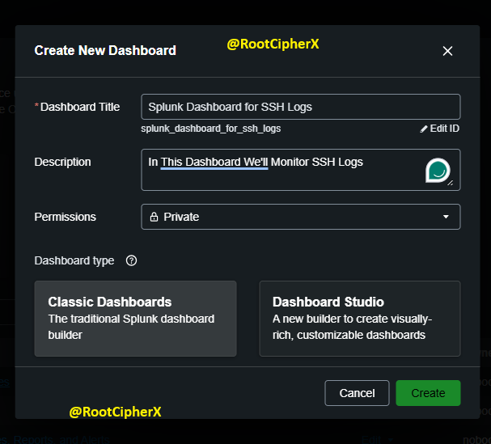

Initialized the blank dashboard workspace in Edit mode and toggled **Dark Theme** to establish a high-contrast SOC console visual layout.
<br>

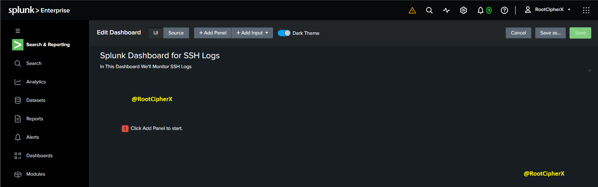

To support dynamic event filtering without modifying raw searches, accessed the **+ Add Input** dropdown to integrate interactive UI controls.
<br>

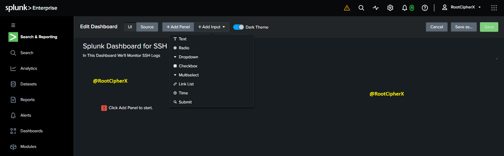

Selected both a **Time** range picker and a **Submit** execution button to ensure that complex analytical queries only execute when the analyst explicitly requests data refreshes.
<br>

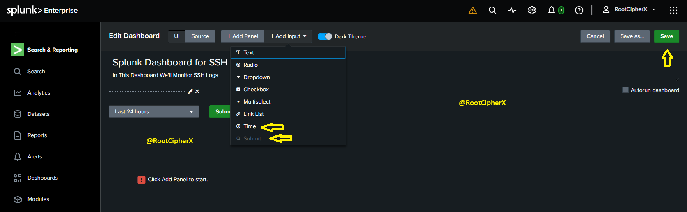

Configured the Time Picker properties:
*   **Label:** `Time Range`
*   **Token Name:** `time_range` (shared variable applied across all subsequent dashboard search panels).
*   **Default Selection:** `All time`
<br>

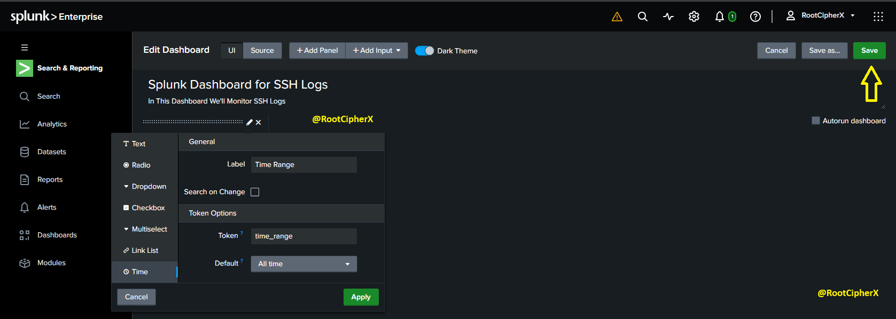

---

### Phase 2: SSH Telemetry Ingestion & Data Onboarding

With the dashboard canvas prepared, the target SSH telemetry required ingestion into the Splunk indexer. Navigated to **Settings -> Add Data** to select the ingestion pipeline.
<br>

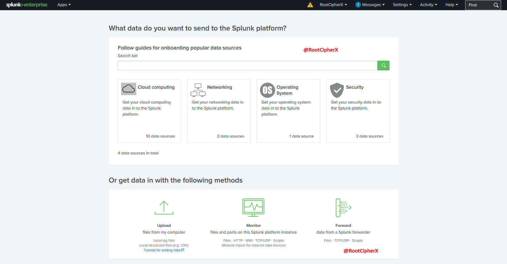

Selected the **Upload** method to load the local telemetry file from the analyst workstation.
<br>

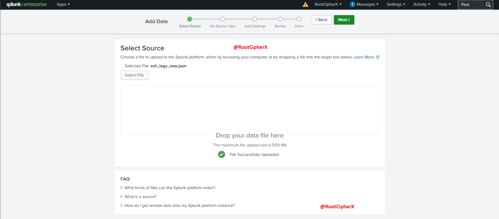

Uploaded `ssh_logs_new.json` and proceeded to the **Set Source Type** step. Splunk's parsing engine automatically matched the data to the `_json` source type, parsing timestamp definitions, session states, and key-value pairs into discrete searchable fields.
<br>

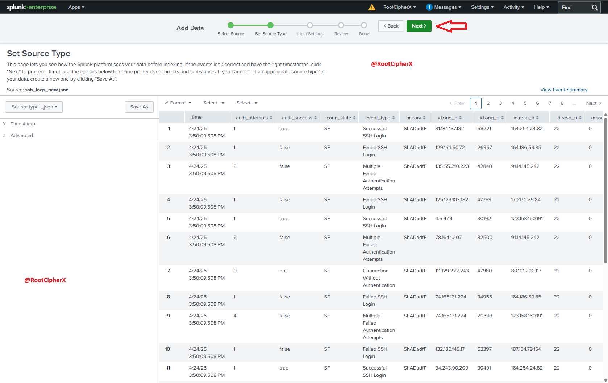

Configured the input metadata properties:
*   **Host Allocation:** Explicitly set the host constant value to `Datta-Guru` to maintain audit attribution across simulated server nodes.
*   **Target Index:** Assigned to the `Default` index.
<br>

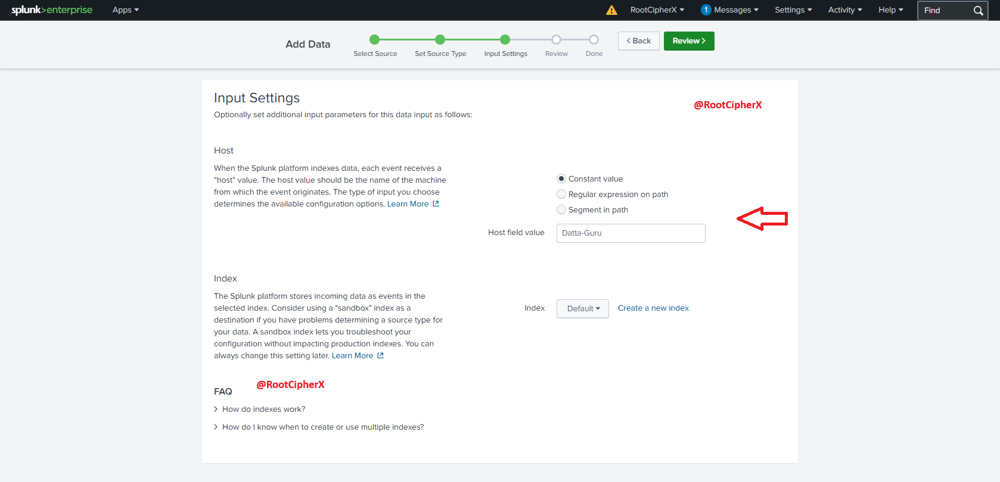

Audited the final ingestion parameters inside the review pane before committing the dataset to storage.
<br>

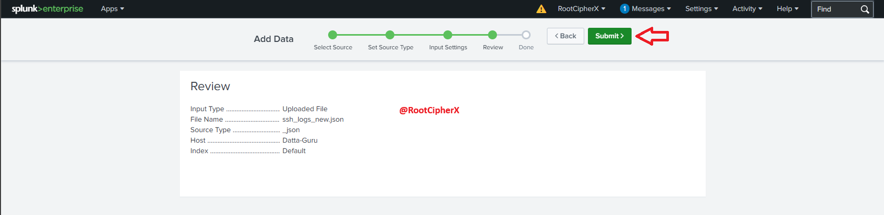

The JSON log file was committed to the indexer. Selected **Start Searching** to initiate baseline discovery.
<br>

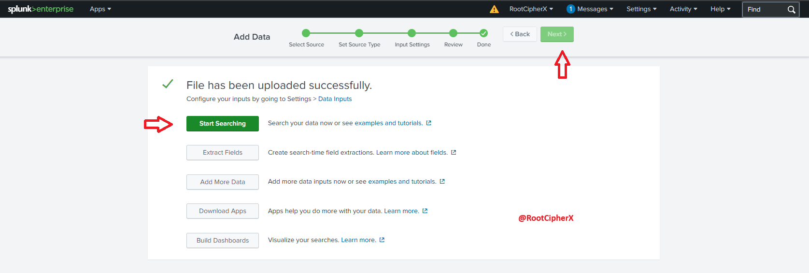

Executed the baseline discovery query to verify total indexed volume and confirm field extraction fidelity:
```spl
source="ssh_logs_new.json" host="Datta-Guru" sourcetype="_json"
```
*   **Validation:** Successfully indexed exactly **2,400 raw events**. Fields such as `auth_attempts`, `event_type`, `id.orig_h`, `id.resp_h`, and `username` populated in the **Interesting Fields** sidebar.
<br>

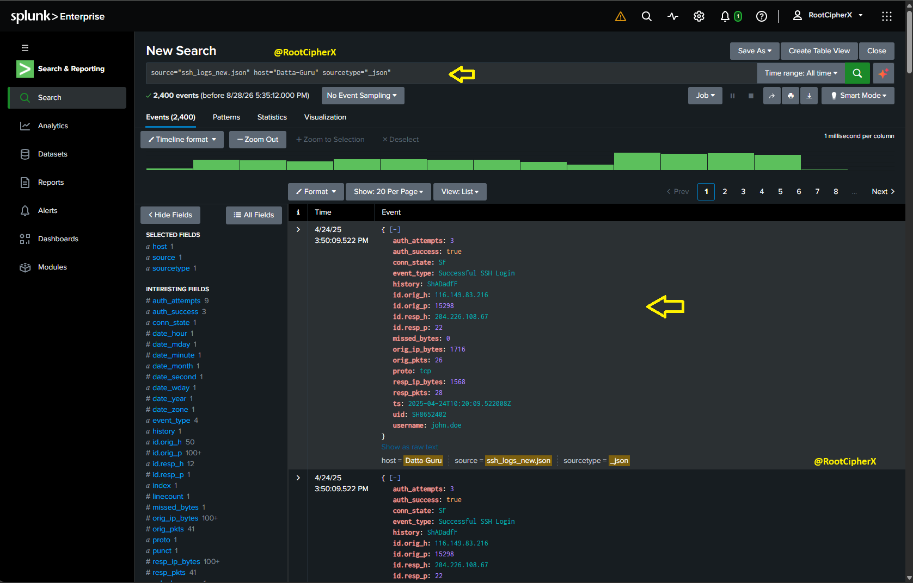

---

### Phase 3: Core Authentication Metrics & Metric Panels

To provide immediate situational awareness, targeted Search Processing Language (SPL) queries were engineered to populate high-level Single Value KPI panels across the top row of the dashboard.

**Query 1: Total Processed SSH Events**
```spl
source="ssh_logs_new.json" host="Datta-Guru" sourcetype="_json" | stats count AS "Total SSH Events"
```
*   **Command Breakdown:** Queries the base source and pipes (`|`) the entire result set into `stats count`, aggregating the total volume of all SSH traffic sessions and renaming the field for presentation.
*   **Result:** Calculated a baseline volume of **2,400 events**.
<br>

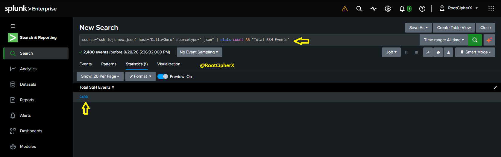

Bound the search to the `time_range` token and converted the output into a **Single Value** visualization titled `Total SSH Events`.
<br>

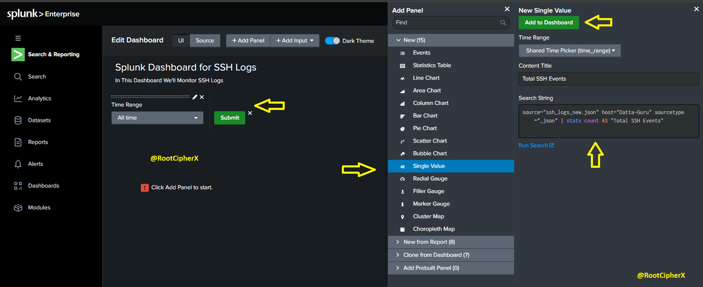

The Single Value card was committed to the dashboard, establishing the aggregate baseline metric of **2,400**.
<br>

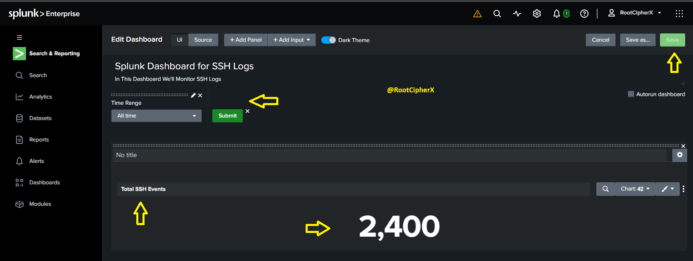

**Query 2: Successful SSH Authentications**
```spl
source="ssh_logs_new.json" host="Datta-Guru" sourcetype="_json" event_type="Successful SSH Login" | stats count AS "Successful Logins"
```
*   **Command Breakdown:** Filters events by appending `event_type="Successful SSH Login"` to isolate verified authentications, passing those specific matches into `stats count`.
*   **Result:** Identified **612** successful access events.
<br>

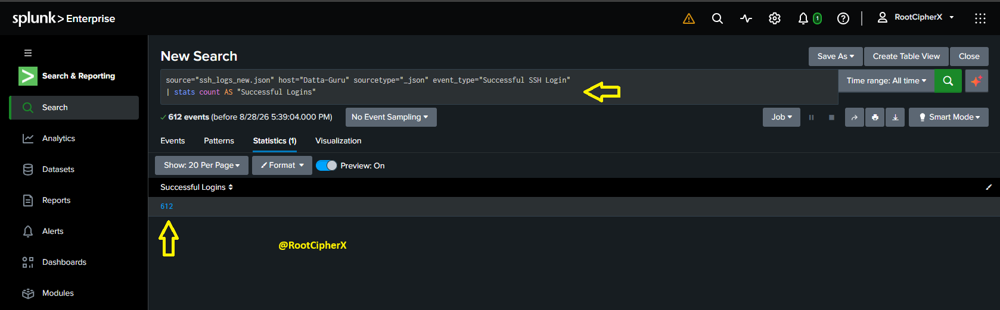

Configured a secondary **Single Value** panel mapped to the shared time picker.
<br>

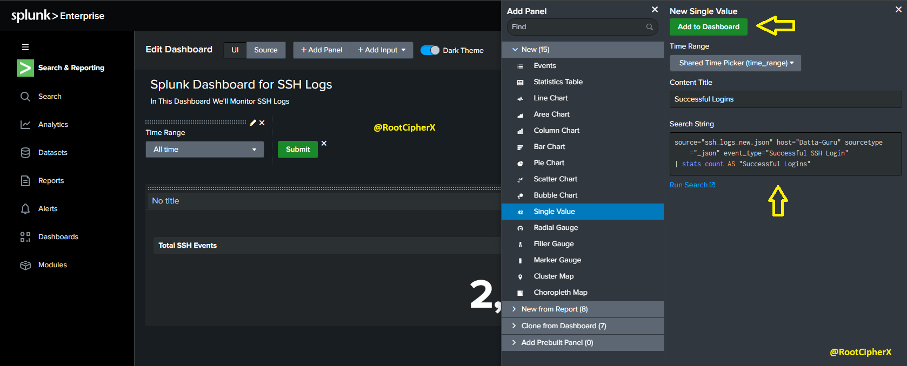

Rendered the metric on the dashboard, displaying **612** successful logins alongside the total event count.
<br>

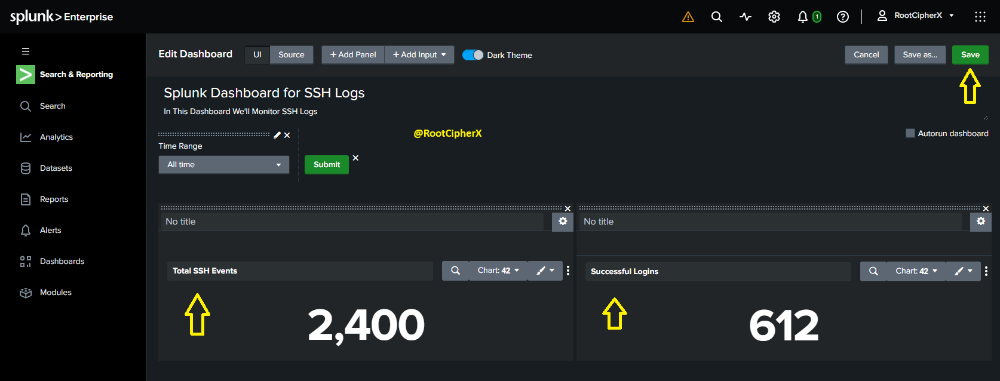

**Query 3: Single Failed Authentication Events**
```spl
source="ssh_logs_new.json" host="Datta-Guru" sourcetype="_json" event_type="Failed SSH Login" | stats count AS "Failed Login"
```
*   **Command Breakdown:** Appends the filter `event_type="Failed SSH Login"` to identify rejected credentials, aggregating the total count via `stats count AS "Failed Login"`.
*   **Result:** Yielded **610** distinct single authentication failure events.
<br>

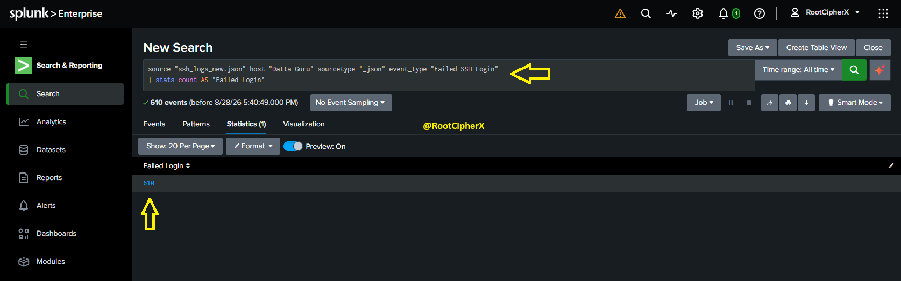

Created the third **Single Value** panel titled `Failed Logins`.
<br>

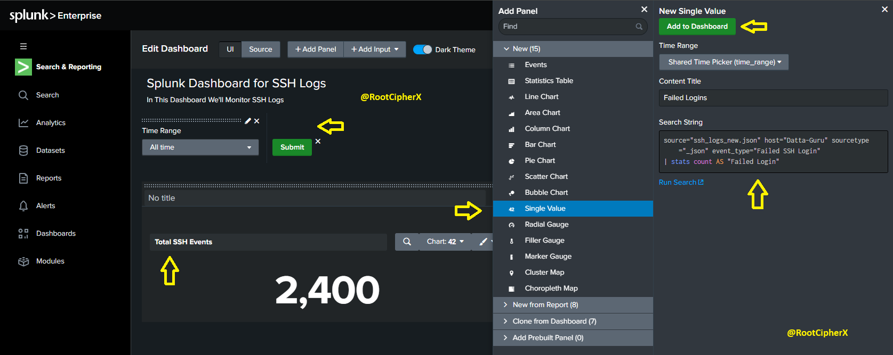

Added the panel to the top row, establishing real-time visibility into the **610** single failed login attempts.
<br>

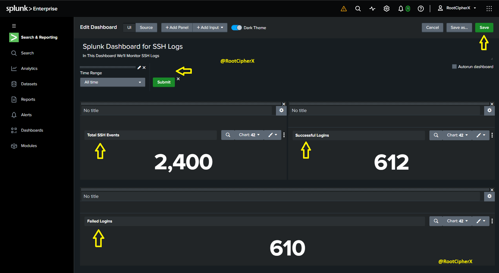

**Query 4: Invalid User & Anomaly Attempts**
```spl
source="ssh_logs_new.json" host="Datta-Guru" sourcetype="_json" | stats count AS "Invalid User Attempts"
```
*   **Command Breakdown:** Evaluates broader session anomalies and invalid user connection requests across the full dataset scope.
*   **Result:** Quantified **2,400** total evaluation attempts across the monitored timeframe.
<br>

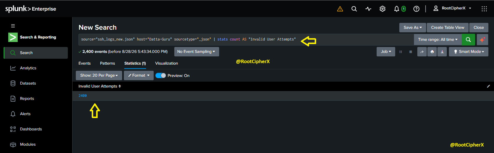

Created the fourth **Single Value** panel labeled `Invalid User Attempts`.
<br>

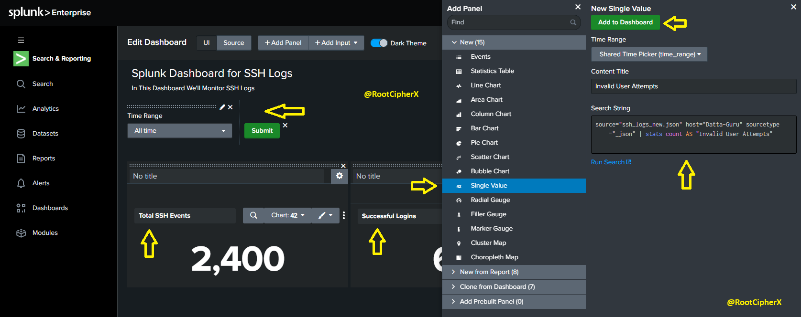

Committed the panel to complete the executive KPI metric row across the top of the dashboard.
<br>

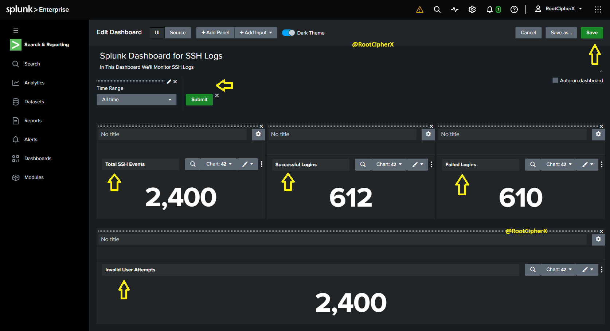

---

### Phase 4: Account Enumeration & Targeted User Analysis

When investigating brute-force campaigns, analysts must determine whether an attacker is spraying common default accounts or targeting specific administrative identities. 

**Query 5: Failed Logins Grouped by Username**
```spl
source="ssh_logs_new.json" host="Datta-Guru" sourcetype="_json" event_type="Failed SSH Login" | top username
```
*   **Command Breakdown:** 
    *   Filters specifically for failed authentications (`event_type="Failed SSH Login"`).
    *   `top username`: An advanced statistical command that automatically aggregates event counts by the `username` field, calculates the percentage distribution of each user relative to the total failure set, and orders the output in descending frequency.
*   **Statistical Findings:** Identifies distinct targeting of privileged and service accounts:
    *   `root`: 54 failures (8.85%)
    *   `backup`: 46 failures (7.54%)
    *   `alice`: 46 failures (7.54%)
    *   `admin`: 44 failures (7.21%)
    *   `test`: 42 failures (6.88%)
    *   `john.doe`: 42 failures (6.88%)
    *   `svc_user`: 40 failures (6.55%)
    *   `service`: 40 failures (6.55%)
    *   `dbadmin`: 40 failures (6.55%)
    *   `webmaster`: 38 failures (6.22%)
<br>

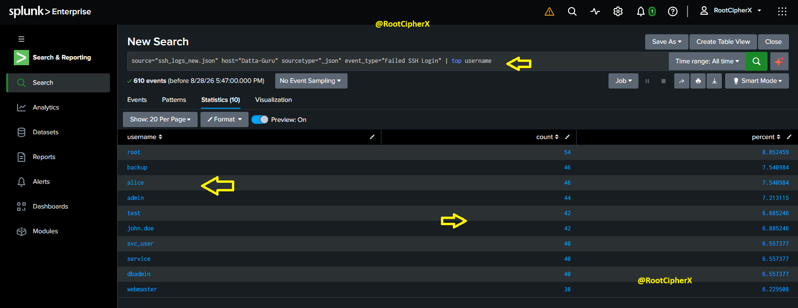

Added the statistical query to the dashboard canvas as a visual panel.
<br>

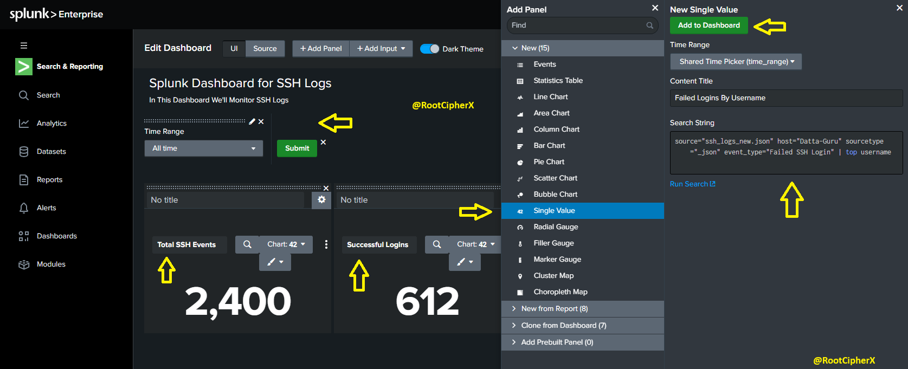

Rendered the data as a styled **Column Chart** under the title `Failed Logins By Username`. This visualization highlights that adversary activity prioritized privileged administrative accounts (`root`, `admin`) and service accounts (`backup`, `svc_user`, `dbadmin`).
<br>

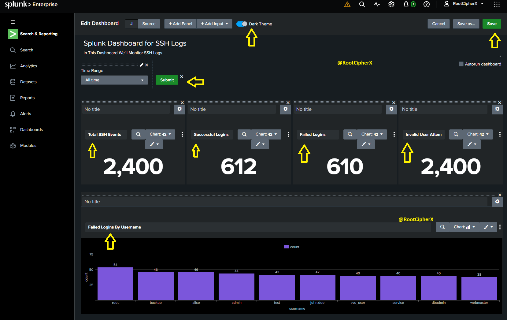

---

### Phase 5: Source Network Triage & Geographic IP Mapping

To identify the origin of the brute-force activity and determine whether attacks were distributed or concentrated, advanced statistical tables and geographic mapping queries were integrated into the dashboard[cite: 1].

**Query 6: High-Frequency Attacking IPs (Brute Force Identification)**
```spl
source="ssh_logs_new.json" host="Datta-Guru" sourcetype="_json" event_type="*Failed*" | top limit=10 id.orig_h
```
*   **Command Breakdown:** Extracts all failed connection iterations (`event_type="*Failed*"`) and aggregates them by client source IP (`id.orig_h`), calculating relative percentages to isolate the most aggressive attacking nodes[cite: 1].
*   **Triaged Threat Sources:** The statistical analysis identified key external IP addresses driving the failed authentication volume[cite: 1]:
    *   `83.195.24.226`: 26 attempts (4.29%)[cite: 1]
    *   `25.47.52.197`: 26 attempts (4.29%)[cite: 1]
    *   `191.47.156.160`: 22 attempts (3.63%)[cite: 1]
    *   `52.173.49.103`: 20 attempts (3.30%)[cite: 1]
    *   `170.86.212.161`: 20 attempts (3.30%)[cite: 1]
    *   `168.154.125.86`: 20 attempts (3.30%)[cite: 1]
    *   `110.177.195.150`: 20 attempts (3.30%)[cite: 1]
    *   `74.165.131.224`: 18 attempts (2.97%)[cite: 1]
    *   `110.16.7.177`: 18 attempts (2.97%)[cite: 1]
    *   `34.243.90.209`: 16 attempts (2.64%)[cite: 1]

**Query 7: Geographic Origin Mapping (Choropleth Projection)**
```spl
source="ssh_logs_new.json" host="Datta-Guru" sourcetype="_json" event_type="*Failed*" 
| table id.orig_h 
| iplocation id.orig_h 
| stats count by Country 
| geom geo_countries featureIdField="Country"
```
*   **Command Breakdown:**
    *   `table id.orig_h`: Isolates client source IP addresses.
    *   `iplocation id.orig_h`: Queries Splunk's internal MaxMind-based IP lookup database to resolve public IP addresses into country, region, and coordinate metadata.
    *   `stats count by Country`: Aggregates the failed connection attempts by the resolved country name.
    *   `geom geo_countries featureIdField="Country"`: Binds the aggregated statistical counts to standardized geometric polygons for global map rendering[cite: 1].
*   **Visual Output:** Rendered within a **Choropleth Map** panel titled `Brute Force Attack With Geo-Location`, grouping origin densities into colored operational tiers (0–40, 40–80, 80–120, 120–160, 160–200) to highlight threat concentration[cite: 1].

---

## 📑 Executive Summary & Exported Artifacts

The final dashboard aggregates authentication health metrics, targeted account frequencies, suspicious source IP rankings, and global origin heatmaps into a unified interface[cite: 1].

To archive and distribute these investigative findings to security leadership, an executive report was generated directly from the Splunk platform[cite: 1]:
*   📄 **View the full exported report here:** [Dhananjay_Splunk_SSH2_Report.pdf](./Dhananjay_Splunk_SSH2_Report.pdf) *(Ensure this PDF file is uploaded directly to the repository root for correct resolution).*

### Summary of Documented Metrics
*   **Total SSH Events Ingested:** 2,400[cite: 1]
*   **Confirmed Successful Logins:** 612[cite: 1]
*   **Single Failed Logins:** 610[cite: 1]
*   **Invalid / Monitored User Attempts:** 2,400[cite: 1]
*   **Primary Targeted Account:** `root` (54 failed attempts)[cite: 1]
*   **Top Attacking Infrastructure:** `83.195.24.226` and `25.47.52.197` (26 attempts each)[cite: 1]

---

## 🛡️ Security Relevance & SOC Impact
Proactive SSH monitoring is a critical operational capability for Security Operations Centers:
*   **Early-Stage Reconnaissance & Spray Detection:** Identifying high volumes of failed logins against generic usernames (`admin`, `test`, `webmaster`) signals automated dictionary attacks before an adversary obtains a valid credential set[cite: 1].
*   **Lateral Movement & Bastion Defense:** Monitoring successful logins (`612` events) alongside failed attempts allows analysts to correlate anomalous spikes in successful authentications occurring outside normal working hours or originating from unusual geographic locations[cite: 1].
*   **Targeted Defensive Controls (Fail2ban / IP Shunning):** The statistical IP breakdown (`id.orig_h`) provides immediate, high-fidelity indicators of compromise (IoCs) that can be ingested into firewalls or automated SOAR playbooks to ban malicious subnets dynamically[cite: 1].

---

## ⚖️ Ethical Guidelines & Disclaimer
This log analysis and SIEM dashboarding project was performed within an authorized, isolated laboratory environment for technical education, defensive engineering, and security analysis purposes. The telemetry analyzed consists of simulated authentication event logs structured to model modern SSH brute-force attack patterns.
